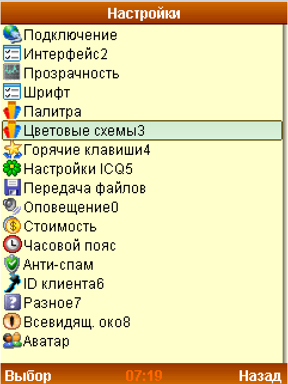
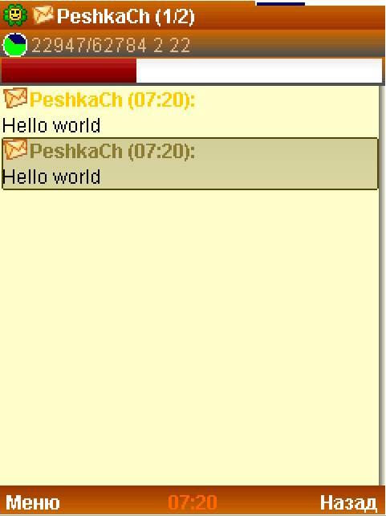

# LocID-skins
Some skins for LocID client (j2me)

# wJimm
Main menu
 
Messaging

# Jimm Xattab
*Jimm Xattab* is just fixed by me.

# KICQ
My **[KICQ](http://kicq.ru/)** UIN: 3-739-186

Screenshots was made on LocID *BitByByte build*. [Download here](https://github.com/ma3rxofficial/j2me-icq-clients)

